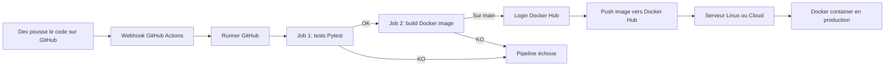

# Architecture du pipeline CI/CD

## Lecture du schéma

- Le code part de GitHub
- GitHub Actions déclenche le pipeline
- Un runner exécute les jobs
- Les tests valident le code
- Docker construit l'image
- Docker Hub stocke l'image
- Le serveur cible peut ensuite la récupérer et la lancer
